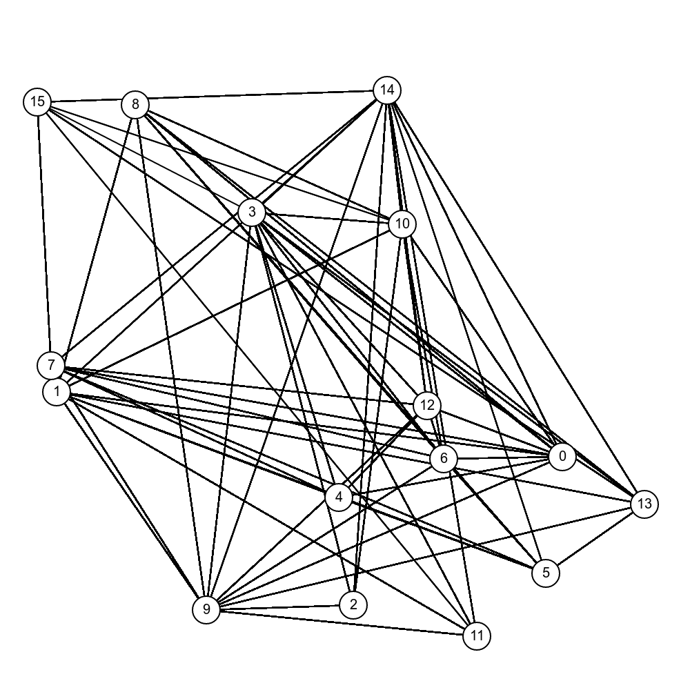
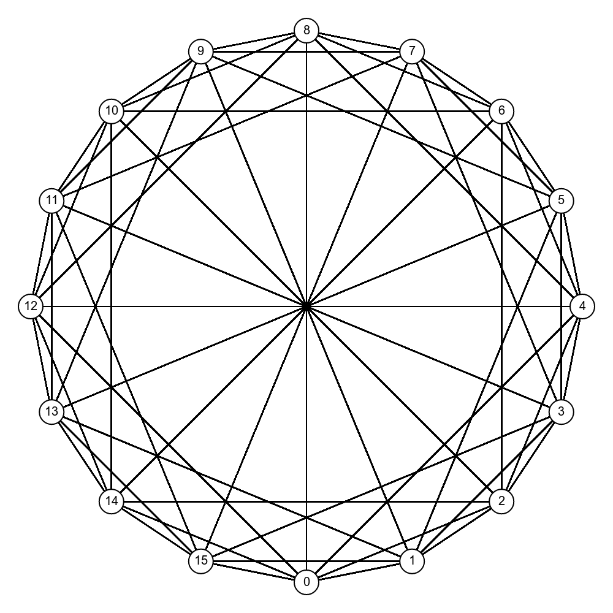
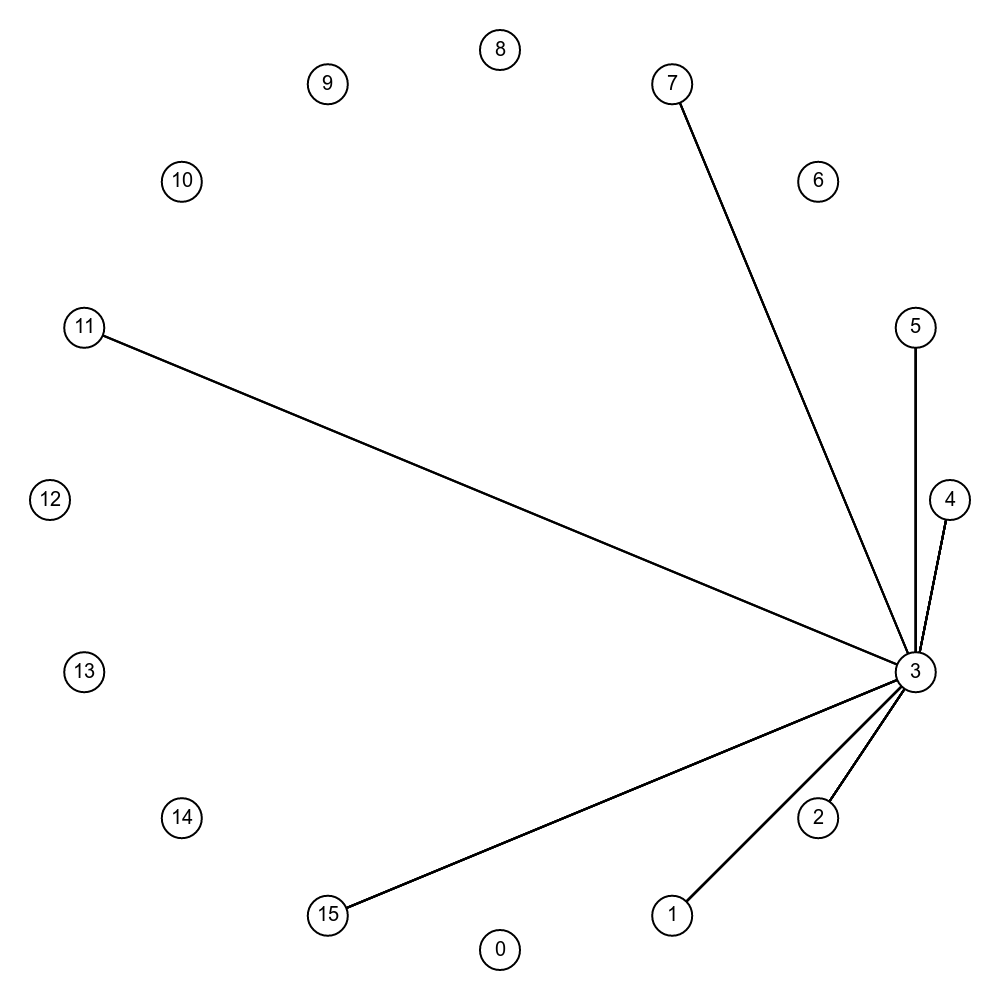

# 
PROBABALISTIC RECURSIVE GOSSIP

A strategy for efficient propogation of state-changes on a peer-to-peer network

 *
By N. P. O’Donnell, 2019
*

## Abstract

Over the past 20 years, peer-to-peer (P2P) networks have become very popular and continue to be an active area of research. While peer-to-peer networks such as Bitcoin, IPFS, FreeNet, and eMule serve different purposes and have different designs, they all share some common requirements: they need to be able to organise themselves without a central authority, discover new nodes joining the network, detect when nodes leave the network, and each participant maintain a sensible number of connections to its peers, such that it may get a reasonable service, making best use of its bandwidth, memory and CPU resources.

In this paper I present a generic design for peer-to-peer networks which is logarithmically scalable and allows boundless growth of information harboured in the system as a whole, by making each node responsible for a subset of resources, and ensuring that new resources and state-changes pertaining to those resources are routed to the most appropriate nodes in a timely and reliable manner.

First we will discuss a numbering system for tagging each node and resource on the P2P network with a unique ID number such that no central authority is required for dispatching ID numbers, yet no two nodes or resources are likely to share the same ID. We we will then discuss an algorithm wherein each node connects preferably to peers with certain IDs over others, forming a topology where an individual node can reach any other node on the network with minimal hops. Next, we describe an algorithm which, when run on the nodes, allows this topology to flourish, ensuring quick integration of new nodes into the fabric, and that any breaks in the topology caused by nodes suddenly leaving, are quickly healed. Finally we present an algorithm for propogating state-changes over this topology that is fast, efficient, accurate, fault-tolerant, and scalable.

### 1. Identification of Nodes and Resources

On any kind of network, the participants need a way of identifying themselves, whether it be to a central authority or to each other. On a typical home local-area-network (LAN), there is usually a router running an algorithm called DHCP, which assigns an IP address to any new device joining the network. The router keeps a record of which devices are assigned which IP addresses, and never assigns the same IP address twice, lest packets be mis-routed and arrive at the wrong destination. The router’s DHCP service acts as a central authority for IP addresses ensuring this chaotic scenario never occurs. The typical home LAN setup is an example of a centralized network.

Unlike centralized networks, P2P networks have no authority responsible for assigning addresses or IDs, so the participants need a way of choosing an ID for themselves that is highly probable to be unique. Some P2P systems use the IP address of the host they’re running on, however this can cause problems if the IP address changes, or the computer is behind a NAT which has other machines also on same P2P network. This could cause outside nodes to think there is only one node on the NAT, when in fact there are several.

One strategy for choosing an ID that’s probably unique is to simply use a massive random number as the ID. A number so large that the chances are negligable that any other node has chosen that number. We will use this approach as our method of ID assignment to both nodes and resouces. For both node IDs and resource IDs, we need enough bits in the ID to ensure:

1. We will never run out of IDs for nodes or resources.
2. We will never randomly choose the same ID twice.

We will use the same number of bits for both node IDs and resource IDs because we want certain resources to have an affinity to certain nodes, specifically those nodes who’s IDs are numerically close to that of the resources. Finally we would like for both node IDs and resource IDs to be evenly distributed. If we choose a random number modulo $2^{\text{Number of bits}}$, these needs are satisfied.

For the examples explained herein we will use a trivial 8 bits for node and resource IDs and pretend that there are never any collisions. For real P2P networks, 8 bits is far too low. 256 or 512 bits is more appropriate. We use the capital letter $N$ to denote the number of bits. Therefore, in the PRG system, each node and each resource will have an N-bit ID, giving a range of  $[0, 2^{N})$. 

For all of the examples, unless otherwise stated, we set $N = 8$.

## 1.1. Modular Distance

Before I begin discussing the network topology, I must define the modular distance function. Every node and resource on the network exists on the circumference of an imaginary circle, with $0$ located at the top of the circle, $2^{N–1}$ at the bottom, $2^{N–2}$ at the centre right,  $3 \times 2^{N–2}$ at the centre left, and all other IDs spaced evenly between them. $2^N$ would be located at the same position as zero except it’s too high. Any number less than 0 or greater than $2^N – 1$ is reduced modulo $2^N$ so that it may appear on the circle.

The modular distance, or *moddist*, between any two IDs, $x$ and $y$ on the circle, is the shortest distance along the circumference of the circle, clockwise or anticlockwise, from one ID to the other.

$$
moddist(x, y) = \left\{ 
         \begin{array}{l l}
            y - x & \quad \text{if }-(2^{N - 1}) < y - x < 2^{N - 1}\\
            2^N + y - x & \quad \text{if }y - x \le -(2^{N - 1})\\
            y - (2^N + x) & \quad \text{if }y - x \ge 2^{N - 1}\\
            0 & \quad \text{if } x = y\\
          \end{array}\right.
$$

## 1.1. Logarithmic Modular Distance

Next we define the logarithmic modular distance funtion, or logdist. This is nothing but the base-2 logarithm of the value of moddist. Note that logdist is undefined if x = y.

$$
logdist(x, y) = log_2 moddist(x, y), x \ne y
$$

## 1.2. Affinity

Finally we define the affinity function. This function gives us a real number between 0 and 1 which indicates how far away x and y are from each other on the circle:

$$
affinity(x, y) = \left\{ 
         \begin{array}{l l}
            1 & \quad \text{if }x = y\\
            1 - \frac{1 + logdist(x, y)}{N} & \quad \text{otherwise}\\
          \end{array}\right.
$$

If x and y are the same, their affinity is 1. If they’re at opposite ends of the circle, their affinity is 0.

## 2. Network Topology

On some P2P networks, notably the Bitcoin network, a node will connect to as many peers as possible and not express any preference for the kind of peer it connects to. This strategy makes some sense for Bitcoin, as its a very time-sensitive application and nodes want to hear about the latest “block” as soon as possible, and the best way to achieve this is to attempt to connect to everybody. When a new bitcoin block is “mined”, it gets bounced around the network chaotically, and every node will soon hear about it, usually more than once.

This is a reliable way of getting the information “out there” about the new block, and works well for Bitcoin since a it’s got a relatively low number of nodes. New blocks are created rather infrequently (every ten minutes), and there’s an upper bound on the size of a block (1Mb). However this simple method of gossip is not satisfactory for systems with a far higher volume of information, especially systems where the overall volume of new information is too great to be handled by any single node.

In addition, it’s not always feasible for a node to connect to as many nodes as possible, because there can be penalties in the underlying transport mechanism for each new connction, which causes an O(N) or worse cost in terms of memory, bandwidth and CPU usage. A good example of this is TCP, where each TCP connection needs to send a “keep-alive” on a regular cadence to all it’s active connections, even if they’re idle. Ideally we’d like to have a predictable upper limit on the number of connections we maintain, which is O(1) in the number of nodes.

At this point we introduce the *Logarithmic Spiderweb* (LS) topology as our network topology of choice for connecting together the nodes on our P2P network. 

||||
|:-|:-|:-|
|*
Unstructured P2P network, e.g. Bitcoin
*|*
Complete LS network with N = 4
*|*
Same LS network showing node 3’s peers
*|

The LS topology limits the number of peers for any single node to $2N – 1$. Using the PRG self-organising algorithm described in the next section, each node will have approximately $p$ peers where $p$ is given by:

$$
p = 2 \times log_2 (n) - 1
$$

and $n$ is the number of nodes on the network. We can manipulate this formula to get an approximation of the number of nodes on the network:

$$
n = 2^{\frac{p + 1}{2}}
$$

In a complete and perfect LS arrangement, that is: where every possible node ID is assigned to exactly one node, and each of these nodes is connected to it’s “ideal” peers, we can compute the overall number of connections:

$$
\text{Number of nodes}: 2^N
$$
$$
\text{Connections per node}: 2N – 1
$$
$$
\text{Overall number of connections}: 2^N(N – 1)
$$

The ideal peers of a node are the nodes whose IDs are exactly $2^i$  away from it where $i \in \{0...N – 1\}$, modulo $2N$. So if a node’s id is $x$, its ideal peers are:

$$
\{(x + 2^0) \mod 2^N, (x – 2^0) \mod 2^N, (x + 2^1) \mod 2^N, (x – 2^1) \mod 2^N, \cdots , (x + 2^{N – 1}) \mod 2^N\}
$$

We leave out $(x – 2^{N – 1}) \mod 2^N$ since it always has the same value as $(x + 2^{N – 1}) \mod 2^N$. Applying this formula to an example, a node with ID 73 would have the following ideal peers:

$$
\{89, 65, 69, 71, 72, 41, 74, 75, 105, 77, 9, 137, 201, 81, 57\}
$$

Encouraging nodes to connect to peers with IDs close to these ideal IDs means a particular node can send a message to any other node on the network, even if not directly connected, with a reasonable number of hops. 